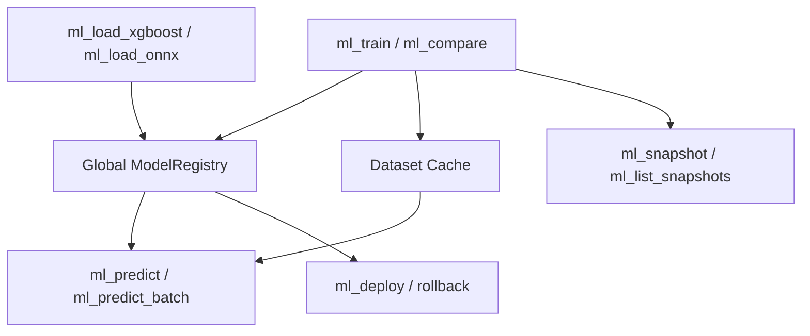

# duckdb-ml

**Lightweight, columnar-native, train+inference ML extension for DuckDB.**
Zero Python dependencies. 18 algorithms in pure Rust.

```sql
-- Train
SELECT * FROM ml_train('my_model', 'random_forest', '[..]', '[[..]]', '{"n_estimators":100}');

-- Predict (single)
SELECT ml_predict('my_model', 3.0, 4.5);

-- Predict (batch)
SELECT * FROM ml_predict_batch('my_model', '[[1.0,2.0],[3.0,4.0]]');
SELECT * FROM ml_predict_batch('my_model', '@my_model'); -- re-use training data

-- AutoML: compare all regression algorithms
SELECT * FROM ml_compare('exp', '[...]', '[[..]]', '[]', 'regression');

-- Deploy + rollback
SELECT * FROM ml_deploy('my_model', 'best_score');
SELECT * FROM ml_deploy('my_model', 'rollback');

-- Data version tracking
SELECT * FROM ml_snapshot('my_model', 'train_data', 4, 250, 'target', '["x1","x2"]', 'abc123');
SELECT * FROM ml_list_snapshots('my_model');
```

## Algorithms (18)

| Category | Algorithms |
|----------|-----------|
| **Linear** | `linear_regression`, `ridge_regression`, `lasso_regression` |
| **Tree** | `decision_tree`, `random_forest` |
| **Gradient Boosting** | `xgboost_regression`, `xgboost_binary` (pure-Rust GBDT) |
| **Neural** | `mlp_regressor` (1-layer, ReLU, SGD+momentum) |
| **Distance** | `knn_regressor`, `knn_classifier` |
| **Bayesian** | `naive_bayes` |
| **Clustering** | `kmeans` |
| **Dim Reduction** | `pca` |
| **External** | `xgboost_regressor`, `xgboost_classifier` (load via `ml_load_xgboost`), `onnx` (load via `ml_load_onnx`) |

## Complete Pipeline Example

```sql
-- 1. Train with AutoML (compares linear, lasso, rf, knn, mlp)
SELECT * FROM ml_compare('house_exp', '[300000,450000,...]',
    '[[3,2,1500],[4,2,2200],...]', '[]', 'regression');

-- 2. Deploy best model
SELECT * FROM ml_deploy('house_exp', 'best_score');

-- 3. Batch predict on training data (auto-cached)
SELECT * FROM ml_predict_batch('house_exp', '@house_exp');

-- 4. Track data version
SELECT * FROM ml_snapshot('house_exp', 'houses_2025', 3, 500,
    'price', '["bedrooms","bathrooms","sqft"]',
    hash_training_data(features, targets));

-- 5. Register an external XGBoost model
SELECT * FROM ml_load_xgboost('xgb_model', '/path/to/model.json');

-- 6. Manual training with custom params
SELECT * FROM ml_train('custom_rf', 'random_forest',
    '[10,20,30,40]', '[[1,2],[3,4],[5,6],[7,8]]',
    '{"n_estimators":200,"max_depth":5}');

-- 7. Query model registry
SELECT * FROM ml_list_models;
```

## Features

- **Train in SQL** — no Python, no Jupyter, no external process
- **AutoML** — `ml_compare` trains all algorithms in parallel, returns comparison table
- **Version Management** — deploy/rollback with strategies (`best_score`, `most_recent`, `rollback`)
- **Batch Prediction** — JSON 2D arrays or `@model_name` cached data references
- **Data Lineage** — `ml_snapshot` records feature columns, sample counts, data hashes
- **Experiment Tracking** — DuckDB-native tables (`duckdb_ml.experiments`, `runs`, `metrics`, `params`)
- **Pure Rust XGBoost** — train GBDT ensembles, serialize to XGBoost-compatible JSON
- **External Models** — load ONNX and pre-trained XGBoost JSON files
- **18 algorithms** — linear, trees, boosting, neural, distance, bayesian, clustering, dim reduction

## Architecture



All models live in a thread-safe global registry (LRU cache, 100 model limit).
Deployment state, snapshot metadata, and cached datasets are all in-memory
(DuckDB loadable extension constraint: no Connection in table functions).

## Build & Install

```bash
git clone git@github.com:alitrack/duckdb-ml.git
cd duckdb-ml
cargo build --release
```

Load in DuckDB:
```sql
LOAD '/path/to/libduckdb_ml.so';
SELECT duckdb_ml();
```

## Development

```bash
cargo test --lib     # 36 tests
cargo clippy -- -D warnings
cargo fmt
```

## License

MIT
