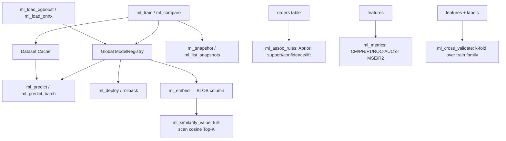

# duckdb-ml

**Lightweight, columnar-native, train+inference ML extension for DuckDB.**
Zero Python dependencies. 18 algorithms in pure Rust.

```sql
-- Train
SELECT * FROM ml_train('my_model', 'random_forest', '[..]', '[[..]]', '{"n_estimators":100}');

-- Predict (single)
SELECT * FROM ml_predict('my_model', '[3.0, 4.5]');

-- Predict (batch)
SELECT * FROM ml_predict_batch('my_model', '[[1.0,2.0],[3.0,4.0]]');
SELECT * FROM ml_predict_batch('my_model', '@my_model'); -- re-use training data

-- AutoML: compare all regression algorithms
SELECT * FROM ml_compare('exp', '[...]', '[[..]]', '[]', 'regression');

-- Deploy + rollback
SELECT * FROM ml_deploy('my_model', 'best_score');
SELECT * FROM ml_deploy('my_model', 'rollback');

-- Data version tracking
SELECT * FROM ml_snapshot('my_model', 'train_data', 4, 250, 'target', '["x1","x2"]', 'abc123');
SELECT * FROM ml_list_snapshots('my_model');

-- Embedding (ONNX encoder, AD-001): f32 LE blob per row
UPDATE media SET embeds = ml_embed('clip', features_json);

-- Similarity: full-scan cosine Top-K over an embedding column
SELECT ml_similarity_value(
    '[0.1, 0.2, ...]',
    (SELECT to_json(list({'row_id': id, 'embeds': embeds})) FROM media),
    10, 0.3);

-- Association rules (market basket, Apriori)
SELECT ml_assoc_rules(
    (SELECT to_json(list({'tid': txn_id, 'items': items}))
     FROM (SELECT txn_id, list(item_id ORDER BY item_id) AS items
           FROM orders GROUP BY txn_id) t),
    0.05,  -- min_support (fraction)
    0.6);  -- min_confidence (fraction)
```

## Algorithms (28)

| Category | Algorithms |
|----------|-----------|
| **Regression** | `linear_regression`, `ridge_regression`, `lasso_regression`, `elastic_net`, `robust` (Huber), `polynomial_regression` (degree ≥ 1, per-feature powers, no interaction terms) |
| **Kernel** | `svm` (classification), `svr` (ε-SVR regression: linear/rbf/poly/sigmoid kernels, hand-written working-set SMO) |
| **Trees** | `decision_tree`, `random_forest` (regression), `rf_classifier` (Gini splits, majority vote; string labels auto-encoded), `adaboost` (SAMME weighted stump ensemble) |
| **Generalized Linear** | `logistic_regression` (binary), `multilogistic` (softmax multi-class), `ordinal` (cumulative-logit ordered multi-class) |
| **Survival** | `cox` (proportional hazards, via `ml_cox_train`), `kaplan_meier` (product-limit curve, via `ml_km_train`; predict = median survival) |
| **Data Aug** | `ml_smote(x_json, y_json, k, dup_ratio)` — deterministic minority oversampling (JSON out) |
| **Ensemble** | `ml_voting(models_json, features_json, mode)` — hard majority / mean over registered models |
| **Time Series** | `arima` (ARIMA(p,d,q) forecasting) |
| **Tree** | `decision_tree`, `random_forest` |
| **Gradient Boosting** | `xgboost_regression`, `xgboost_binary` (pure-Rust GBDT); `xgboost_binary` + `num_class>2` → multi-class softmax (multi:softprob, K trees/round) |
| **Neural** | `mlp_regressor` (1-layer, ReLU, SGD+momentum) |
| **Distance** | `knn_regressor`, `knn_classifier` |
| **Bayesian** | `naive_bayes` |
| **Kernel** | `svm` (binary SVC, linear/Gaussian kernel, libsvm SMO core) |
| **Clustering** | `kmeans`, `fuzzy_cmeans` (soft-assignment, fuzziness m), `dbscan` (density-based, noise detection, linfa-clustering) |
| **Dim Reduction** | `pca` (unsupervised), `lda` (supervised, generalized eigenproblem S_b v = λ S_w v, ridge-Cholesky + deflated power iteration), `tsne` (nonlinear 2D embedding, deterministic; predict = nearest-row embedding) |
| **External** | `xgboost_regressor`, `xgboost_classifier` (load via `ml_load_xgboost`), `onnx` (load via `ml_load_onnx`) |

## Metrics & Model Validation

Model-quality tools (MADlib `pred_metrics` / `validation` counterparts):

```sql
-- Binary classification: confusion matrix, accuracy, precision, recall, F1, ROC AUC
SELECT ml_metrics('[1,0,1,0,1]', '[0.9,0.1,0.8,0.3,0.6]', 'binary');

-- Regression: MSE, RMSE, MAE, R²
SELECT ml_metrics('[1.0,2.0,3.0]', '[0.9,2.2,3.1]', 'regression');

-- Auto task detection (actuals ∈ {0,1} → binary, else regression)
SELECT ml_metrics('[1,0,1]', '[1,1,0]');

-- K-fold cross validation over any ml_train_model algorithm
SELECT ml_cross_validate('linear_regression',
    '[[0.0],[1.0],[2.0],[3.0],[4.0],[5.0]]',
    '[1.0,3.0,5.0,7.0,9.0,11.0]',
    '{"lambda": 0.1}',  -- hyperparameters, or NULL
    '5');               -- folds (optional, default 5)
```

- `ml_metrics`: binary accepts labels **or probabilities** (threshold 0.5 for
  the confusion matrix; ROC AUC uses the raw scores with tie handling).
- `ml_cross_validate`: deterministic sequential folds (fold f = indices with
  `i % k == f`); returns per-fold and mean `mse`/`r2`.

> **Note on descriptive statistics** — duckdb-ml deliberately focuses on ML
> algorithms only. For descriptive statistics, hypothesis tests (t / χ² / F)
> and R-style distributions, use the community
> [stats_duck](https://github.com/duckdb/community-extensions) plugin:
> `INSTALL stats_duck; LOAD stats_duck;` — it composes cleanly with `ml_*`
> functions in the same query.

## DBSCAN Clustering

Density-based clustering with noise detection, powered by
[linfa-clustering](https://crates.io/crates/linfa-clustering) (MIT).
`eps` is the neighborhood radius, `min_points` the core-point density;
points with fewer than `min_points` neighbors are noise.

```sql
-- Train (unsupervised: y is a dummy column, ignored by dbscan)
SELECT ml_train_model('m', 'dbscan', '[1,1,1,1]',
    '[[0.0,0.0],[0.1,0.0],[5.0,5.0],[5.1,5.0]]',
    '{"eps": 0.3, "min_points": 2}');

-- Predict: nearest cluster representative (MADlib-style, noise → closest)
SELECT ml_predict_batch_value('m', '[[0.05,0.05],[5.0,5.1]]');
```

The trained model stores per-cluster means + counts; `ml_predict_batch_value`
returns the nearest-cluster label (0..k-1).

## SVM Classification

Binary Support Vector Classifier powered by
[linfa-svm](https://crates.io/crates/linfa-svm) (MIT, libsvm SMO solver).
Labels must be 0/1; choose the kernel with `kernel` (0 = linear, 1 = Gaussian/RBF,
2 = polynomial). Polynomial kernel takes `degree` (default 3) and `coef0`
(default 0).

```sql
-- Linear kernel
SELECT ml_train_model('m', 'svm', '[0,0,1,1]',
    '[[-1.0,-1.0],[-0.9,-0.8],[1.0,1.0],[1.1,1.2]]',
    '{"kernel": 0, "c": 1.0}');

-- Gaussian/RBF kernel (nonlinear boundaries)
SELECT ml_train_model('m', 'svm', '[1,1,0,0]',
    '[[0.2,0.1],[0.1,0.2],[2.0,0.0],[0.0,2.0]]',
    '{"kernel": 1, "gamma": 1.0}');

SELECT ml_predict_batch_value('m', '[[-0.5,-0.5],[0.8,0.9]]');
```

Hyperparameters: `c` (misclassification penalty, default 1.0),
`gamma` (Gaussian kernel radius, default 1.0), `kernel` (0/1, default RBF).
The trained model embeds support vectors + dual coefficients via bincode
(serde); prediction reuses linfa's own decision path. Model blob includes the
feature count, so `ml_predict_batch_value` validates dimensions.

## Multinomial Logistic Regression (multilogistic)

Softmax multi-class classifier (MADlib `multilogistic` counterpart),
hand-rolled full-batch gradient descent over cross-entropy — no new deps.
Class labels can be **any distinct numbers** (e.g. 10/20/30); `predict`
returns the original label values.

```sql
SELECT ml_train_model('m', 'multilogistic', '[10,10,20,20,30,30]',
    '[[-5.0],[-4.9],[0.0],[0.1],[5.0],[5.1]]',
    '{"lr": 0.1, "max_epochs": 1000}');

SELECT ml_predict_batch_value('m', '[[-4.0],[4.0],[0.2]]');
-- [10.0, 30.0, 20.0]
```

Hyperparameters: `lr` (learning rate, default 0.1), `max_epochs` (default 500,
early-stops on loss plateau). Training is deterministic (zero-init weights).

## Ordinal Logistic Regression (ordinal)

Cumulative-logit (proportional odds) ordinal classifier (MADlib `ordinal`
counterpart), hand-rolled full-batch gradient descent over the exact NLL —
no new deps. Thresholds are chained (θ_j = θ_1 + Σ e^{δ}) so ordering is
guaranteed monotone. Labels can be any distinct numbers; `predict` returns
the original label values.

```sql
SELECT ml_train_model('m', 'ordinal', '[0,0,0,1,1,1,2,2,2]',
    '[[-4.0],[-3.0],[-2.0],[0.0],[1.0],[2.0],[4.0],[5.0],[6.0]]',
    '{"lr": 0.1, "max_epochs": 800}');

SELECT ml_predict_batch_value('m', '[[-3.0],[1.0],[5.0]]');
-- [0.0, 1.0, 2.0]
```

Hyperparameters: `lr` (default 0.1), `max_epochs` (default 800).

## Cox Proportional Hazards (cox)

Survival regression (MADlib `cox_prop_hazards` counterpart), hand-rolled
partial likelihood with Breslow tie handling — no new deps. Training needs
three arrays (time, event, features), so it has its own entry point:

```sql
SELECT ml_cox_train('m', '[1.2,0.8,2.1,0.5,1.8]',  -- survival times
    '[1,1,0,1,1]',                                 -- event flags (0=censored)
    '[[1.0],[2.0],[0.5],[3.0],[1.5]]',
    '{"lr": 0.05, "max_epochs": 2000}');

SELECT ml_predict_batch_value('m', '[[1.0],[2.0],[0.5]]');
-- relative risks exp(w·x): [9.35, 87.44, 3.06]
```

Predictions are hazard ratios exp(w·x) relative to the baseline (x = 0).
Hyperparameters: `lr` (default 0.05), `max_epochs` (default 2000).
Coefficients can be inspected via `ml_get_model_metadata('m')`.

## ARIMA Time Series (arima)

ARIMA(p,d,q) forecaster (MADlib `arima` counterpart), hand-rolled
conditional least squares — pure AR (q=0) uses a closed-form normal-equation
solve (exact, no tuning); ARMA with q>0 uses gradient descent with
central-difference gradients. `predict` takes a one-element feature array
`[h]` and returns the h-step-ahead forecast (future residuals = 0,
differencing reversed exactly).

```sql
SELECT ml_train_model('m', 'arima', '[5,9,12.2,14.76,16.808,18.446]',
    '[[0],[0],[0],[0],[0],[0]]',   -- features are placeholder (unused)
    '{"p": 1, "d": 0, "q": 0}');

SELECT ml_predict_batch_value('m', '[[1]]');
-- one-step forecast, e.g. 19.757 (matches y_t = 5 + 0.8·y_{t-1} exactly)
```

Hyperparameters: `p`/`d`/`q` (AR order / differencing / MA order, defaults
1/0/0), `lr` (default 0.05, ARMA only), `max_epochs` (default 1000, ARMA
only). Forecast horizon must be in [1, 100000].

## Robust Regression (robust)

Outlier-resistant linear regression (MADlib `robust` counterpart) via Huber
loss + iteratively reweighted least squares (IRLS) — starts from OLS, then
reweights by `w_i = 1` if `|r_i|/(1.4826·MAD) ≤ c` else `c·|r_i|/...`, and
iterates to convergence. Deterministic; same model format as
`linear_regression`.

```sql
SELECT ml_train_model('m', 'robust',
    '[0,3,6,9,12,15,18,21,24,27,1000,33,36,39,42,45,48,51,54,57]',  -- outlier at 1000
    '[[0],[1],[2],[3],[4],[5],[6],[7],[8],[9],[10],[11],[12],[13],[14],[15],[16],[17],[18],[19]]',
    '{"c": 1.345, "max_iters": 50}');

SELECT ml_predict_batch_value('m', '[[20]]');
-- 60.0 (OLS on the same data gives 116.2 — pulled by the outlier)
```

Hyperparameters: `c` (Huber cutoff, default 1.345), `max_iters` (default 50).

## Elastic Net Regression (elastic_net)

Ridge + lasso blend (`α·l1_ratio·‖β‖₁ + α·(1−l1_ratio)·‖β‖₂²`), trained by
cyclical coordinate descent with soft-thresholding (sklearn's algorithm).
`l1_ratio=0` reduces to ridge, `l1_ratio=1` to lasso. Coefficients are on the
raw-feature scale (features are centered internally).

```sql
SELECT ml_train_model('m', 'elastic_net', '[2,5,8,11,14,17,20,23,26,29]',
    '[[0],[1],[2],[3],[4],[5],[6],[7],[8],[9]]',
    '{"alpha": 0.0001, "l1_ratio": 0.5}');
SELECT ml_predict_batch_value('m', '[[10]]');  -- ~32
```

Hyperparameters: `alpha` (overall strength, default 1.0), `l1_ratio`
(L1 mixing, default 0.5), `max_iter` (default 1000).

## Support Vector Regression (svr)

ε-SVR with four kernels (linear/rbf/poly/sigmoid), solved by a
hand-written working-set SMO (libsvm-style pair selection with KKT
checking). Predictions are `Σ βᵢ·K(xᵢ, x) + b` over support vectors.

```sql
SELECT ml_train_model('m', 'svr',
    '[1,4,9,16,25,36,49,64,81,100]',
    '[[1],[2],[3],[4],[5],[6],[7],[8],[9],[10]]',
    '{"kernel": 1, "c": 100, "epsilon": 0.001, "gamma": 0.5}');
SELECT ml_predict_batch_value('m', '[[5.5]]');  -- ~30.25
```

Hyperparameters: `kernel` (0=linear, 1=rbf, 2=poly, 3=sigmoid; default
1), `c` (default 1.0), `epsilon` (tube width, default 0.1), `gamma`
(rbf/poly/sigmoid, default 1/n_features), `degree` (poly, default 3),
`coef0` (poly/sigmoid, default 0), `tol` (SMO tolerance, default 1e-3),
`max_iter` (default 2000). Dataset limit: ≤ 1000 rows (kernel matrix).

## Complete Pipeline Example

```sql
-- 1. Train with AutoML (compares linear, lasso, rf, knn, mlp)
SELECT * FROM ml_compare('house_exp', '[300000,450000,...]',
    '[[3,2,1500],[4,2,2200],...]', '[]', 'regression');

-- 2. Deploy best model
SELECT * FROM ml_deploy('house_exp', 'best_score');

-- 3. Batch predict on training data (auto-cached)
SELECT * FROM ml_predict_batch('house_exp', '@house_exp');

-- 4. Track data version
SELECT * FROM ml_snapshot('house_exp', 'houses_2025', 3, 500,
    'price', '["bedrooms","bathrooms","sqft"]',
    hash_training_data(features, targets));

-- 5. Register an external XGBoost model
SELECT * FROM ml_load_xgboost('xgb_model', '/path/to/model.json');

-- 6. Manual training with custom params
SELECT * FROM ml_train('custom_rf', 'random_forest',
    '[10,20,30,40]', '[[1,2],[3,4],[5,6],[7,8]]',
    '{"n_estimators":200,"max_depth":5}');

-- 7. Query model registry
SELECT * FROM ml_list_models;
```

## Features

- **Train in SQL** — no Python, no Jupyter, no external process
- **AutoML** — `ml_compare` trains all algorithms in parallel, returns comparison table
- **Version Management** — deploy/rollback with strategies (`best_score`, `most_recent`, `rollback`)
- **Batch Prediction** — JSON 2D arrays or `@model_name` cached data references
- **Data Lineage** — `ml_snapshot` records feature columns, sample counts, data hashes
- **Experiment Tracking** — DuckDB-native tables (`duckdb_ml.experiments`, `runs`, `metrics`, `params`)
- **Embeddings** — `ml_embed` (ONNX encoder → f32 LE BLOB, per-row, UPDATE-friendly) + `ml_similarity_value` (full-scan cosine Top-K with threshold, k cap 10000, skip/warning stats, cancellation flag)
- **Association Rules** — `ml_assoc_rules` (Apriori, market basket): support/confidence/lift, min_support + min_confidence filters, itemset-size cap, candidate/rule blowup guards, cancellation flag
- **Model Metrics & Validation** — `ml_metrics` (confusion matrix / PR / F1 / ROC AUC / MSE / MAE / R² with auto task detection) + `ml_cross_validate` (k-fold over any algorithm, deterministic folds)

## Association Rules (Apriori)

Market basket analysis over transaction data, matching MADlib's `assoc_rules`
semantics (support = itemset transactions / total, confidence = supp(A∪B)/supp(A),
lift = confidence / supp(B)).

```sql
SELECT ml_assoc_rules(
    (SELECT to_json(list({'tid': txn_id, 'items': items}))
     FROM (SELECT txn_id, list(item_id ORDER BY item_id) AS items
           FROM orders GROUP BY txn_id) t),
    0.05,   -- min_support (0, 1]
    0.6,    -- min_confidence (0, 1]
    4);     -- optional max_itemset_size (0 = unlimited)
```

Returns JSON: `{"rules":[{antecedent,consequent,support,confidence,lift}],
"frequent_itemsets":[{items,support}], "stats":{transactions,candidates,
rules,cancelled,truncated}}`. Unnest into a relation with `from_json`:

```sql
WITH r AS (
    SELECT from_json(ml_assoc_rules(
        (SELECT to_json(list({'tid': txn_id, 'items': items}))
         FROM (SELECT txn_id, list(item_id ORDER BY item_id) AS items
               FROM orders GROUP BY txn_id) t),
        0.05, 0.6),
        '{"rules": [{"antecedent": ["VARCHAR"], "consequent": ["VARCHAR"],
                     "support": "DOUBLE", "confidence": "DOUBLE",
                     "lift": "DOUBLE"}]}') AS parsed
)
SELECT unnest(parsed.rules) AS rule FROM r;
```

- Items accept string/number/bool scalars, deduplicated per transaction;
  `tid` is optional. NULL items skipped; object/array items error.
- Deterministic ordering: confidence desc → support desc → antecedent length asc.
- Defensive caps: 2M candidates / 1M rules per run (truncated flag, no OOM);
  global cancel flag for embedded callers (`set_assoc_cancel(true)`), checks
  every 4096 work units so small scans are never interrupted.

## Embedding & Similarity (AD-001)

Storage follows the Lap pattern: embeddings live in a plain `BLOB` column
(f32 little-endian packed, `4 × dim` bytes), no separate vector database.
Similarity retrieval is an explicit full-scan task — zero external components.

```sql
-- 1. Load an ONNX encoder model (CLIP, MiniLM, ...)
SELECT * FROM ml_load_onnx('clip', '/models/clip_text.onnx', 77);

-- 2. Embed a column into a BLOB column (per-row, works in UPDATE)
CREATE TABLE media_embeds AS
SELECT id, ml_embed('clip', token_ids) AS embeds FROM media;

-- 3. Similarity scan: query vector (JSON or hex) + candidates from a subquery
SELECT ml_similarity_value(
    '[0.1, 0.2, ...]',                       -- query embedding
    (SELECT to_json(list({'row_id': id, 'embeds': embeds})) FROM media_embeds),
    10,                                      -- k (default 10, cap 10000)
    0.3);                                    -- threshold (default 0.0)
```

Result JSON: `{"results":[{"row_id":1,"score":0.99},...],"scanned":N,
"skipped_null":a,"skipped_bad_len":b,"skipped_dim":c,"cancelled":false}`.

- Candidates accept struct form (`{"row_id":N,"embeds":...}`) or pair form
  (`[N, ...]`); embedding payloads accept DuckDB JSON binary strings
  (`to_json(blob)` output, e.g. `"\x00\x00\x80?"`), hex strings, or JSON vectors.
- Score = cosine similarity of L2-normalized vectors, clamped to [-1, 1].
- Rows with blob length % 4 != 0 are skipped and counted; dimension mismatches
  score 0.0 and are counted; NULL embeddings skipped. Empty table → empty result.
- Cancellation: embedded (rlib) callers can `set_similarity_cancel(true)` to
  abort a scan (returns partial top-k with `"cancelled": true`); at the SQL
  layer DuckDB's query interrupt terminates the statement.
- HNSW acceleration (hnsw_rs 0.3.4, MIT/Apache-2.0, pure Rust — evaluated
  2026-08) is deferred until a >500k-row benchmark shows full-scan is too slow.
- **Pure Rust XGBoost** — train GBDT ensembles, serialize to XGBoost-compatible JSON
- **External Models** — load ONNX and pre-trained XGBoost JSON files
- **18 algorithms** — linear, trees, boosting, neural, distance, bayesian, clustering, dim reduction

## Architecture


```mermaid
flowchart TD
    A[ml_train / ml_compare] --> B[Global ModelRegistry]
    B --> C[ml_predict / ml_predict_batch]
    A --> D[Dataset Cache]
    D --> C
    B --> E[ml_deploy / rollback]
    A --> F[ml_snapshot / ml_list_snapshots]
    G[ml_load_xgboost / ml_load_onnx] --> B
    B --> H[ml_embed → BLOB column]
    H --> I[ml_similarity_value: full-scan cosine Top-K]
    J[orders table] --> K[ml_assoc_rules: Apriori support/confidence/lift]
    L[features] --> M[ml_metrics: CM/PR/F1/ROC-AUC or MSE/R2]
    N[features + labels] --> O[ml_cross_validate: k-fold over train family]
```

All models live in a thread-safe global registry (LRU cache, 100 model limit).
Deployment state, snapshot metadata, and cached datasets are all in-memory
(DuckDB loadable extension constraint: no Connection in table functions).
Embeddings live in user tables (BLOB columns); similarity scans decode and
score in a streaming cursor with a cancellation flag.

## Build & Install

```bash
git clone git@github.com:alitrack/duckdb-ml.git
cd duckdb-ml
cargo build --release
```

Load in DuckDB:
```sql
LOAD '/path/to/libduckdb_ml.so';
SELECT duckdb_ml();
```

## Development

```bash
cargo test --lib     # 36 tests
cargo clippy -- -D warnings
cargo fmt
```

## License

MIT
